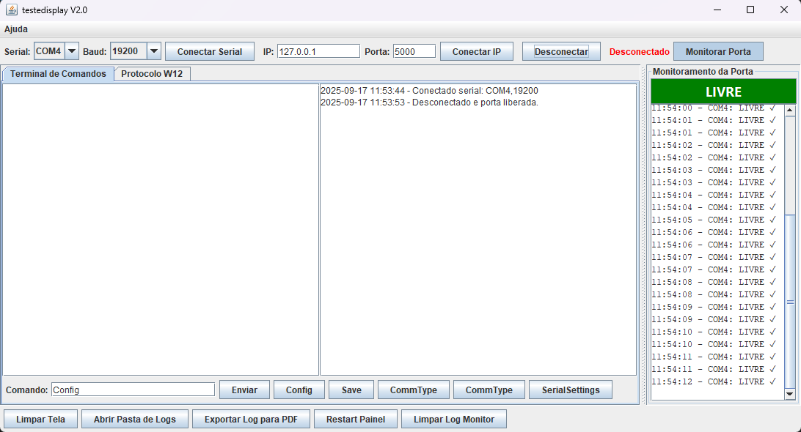

# Testador para Painel de LEDs WT-DISPLAY


Uma ferramenta de desktop em Java Swing para testes de comunicação e funcionalidade com o painel de LEDs **WT-DISPLAY** da Weightech.

Este aplicativo permite a comunicação via Serial (RS-232/RS-485) ou TCP/IP, oferecendo tanto um terminal de baixo nível para envio de comandos de configuração quanto uma interface de alto nível para controle visual do painel através do Protocolo W12.

---

## ✨ Funcionalidades

*   **Duplo Modo de Conexão:** Conecte-se ao painel via porta Serial ou soquete TCP/IP.
*   **Detecção de Portas:** Detecção automática das portas seriais disponíveis.
*   **Terminal de Comandos:** Uma interface para enviar comandos de texto (ex: `Config`, `Save`, `Protocol=W01`) e visualizar as respostas brutas do painel.
*   **Painel de Controle W12:** Uma interface gráfica completa para testar as funcionalidades visuais do painel (semáforos, bargraph, mensagens pré-definidas) sem precisar montar os pacotes de bytes manualmente.
*   **Logging Avançado:** Todos os comandos enviados e dados recebidos são exibidos na tela e salvos em arquivos de log com data e hora.
*   **Gerenciamento de Configs:** O aplicativo salva suas últimas configurações de conexão (porta, IP, etc.) para facilitar o uso futuro.

## 🛠️ Pré-requisitos

*   **Java JDK 21** ou superior.
*   **Apache Maven** para compilação.

## 🚀 Como Compilar e Executar

1.  **Clone o repositório:**
    ```bash
    git clone https://github.com/seu-usuario/testedisplay.git
    cd testedisplay
    ```

2.  **Compile o projeto com Maven:**
    O comando abaixo irá baixar as dependências e criar um arquivo JAR executável.
    ```bash
    mvn clean package
    ```

3.  **Execute a aplicação:**
    O arquivo JAR final será criado no diretório `target/`. Use o seguinte comando para iniciar:
    ```bash
    java -jar target/testedisplay-1.0.0-jar-with-dependencies.jar
    ```

## 💿 Aplicação Executável (EXE)

Para conveniência, uma versão executável para Windows (`.exe`) está disponível na pasta `dist/`. Você pode usar este arquivo em vez de compilar o projeto manualmente.

## 🖥️ Como Usar

1.  **Conexão:** No topo da janela, escolha o tipo de conexão (Serial ou IP), preencha os dados e clique em "Conectar". O status da conexão será exibido.

2.  **Terminal de Comandos:**
    *   Use esta aba para enviar comandos de configuração, como `Config`, `Save`, `SerialSettings=...`, etc.
    *   Os comandos enviados e as respostas recebidas aparecerão nas áreas de texto.

3.  **Protocolo W12:**
    *   Use esta aba para controlar os recursos visuais do painel.
    *   Selecione as cores e o modo dos semáforos, escolha a mensagem, defina o valor do peso e do bargraph usando os controles visuais.
    *   Clique em **"Enviar Pacote W12"** para enviar o comando ao painel.

## 🧰 Dependências

*   **jSerialComm:** Biblioteca para comunicação via porta serial em Java.
*   **iTextPDF:** Biblioteca para a funcionalidade de exportação de logs para PDF.

## ✒️ Autor

*   **Renato Félix** (Desenvolvedor Original)
*   **Gemini** (Refatoração e implementação do W12)

## 📝 Licença

Este projeto está sob a licença MIT. Consulte o arquivo `LICENSE` para obter mais detalhes (atualmente vazio).

